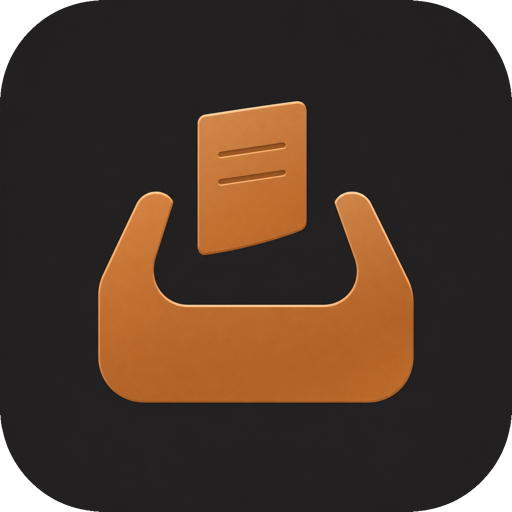
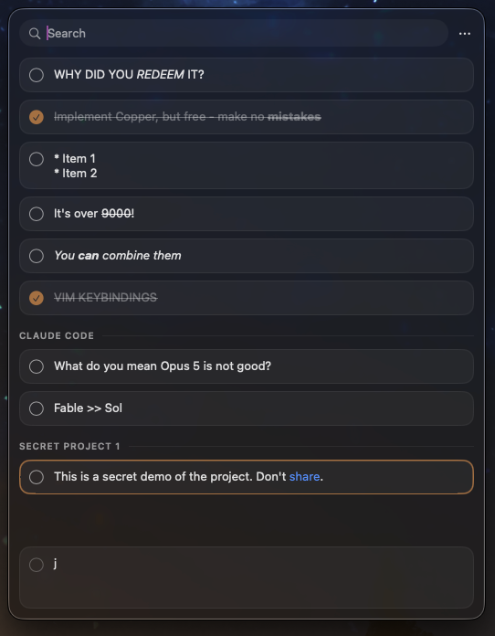

<p align="center">
  
</p>

<h1 align="center">Bronze</h1>

<p align="center">
  A local, open-source scratchpad for working with AI.<br>
  Built for macOS, fast from the keyboard, and inspired by Copper.
</p>

<p align="center">
  <a href="https://github.com/shiroyasha9/bronze/releases/latest"></a>
  <a href="LICENSE"></a>
  
</p>

Select text in almost any app, double-press Shift, and it becomes a checklist note beside your work. Copy notes back out individually or as a numbered list for ChatGPT, Claude, Cursor, or anywhere else.

<p align="center">
  
</p>

https://github.com/user-attachments/assets/6731b337-98c5-49b7-a1f3-261ffc11b4eb

## Download

Get the signed and notarized app from [Gumroad](https://mubinansari.gumroad.com/l/bronze). Copper costs $39. Bronze is pay what you want, with a suggested price of $3.90 and a minimum of $0. The same build is free on [GitHub Releases](https://github.com/shiroyasha9/bronze/releases).

1. Open the downloaded `.dmg` and drag Bronze to Applications.
2. Launch Bronze from Applications. It appears in the menu bar without a Dock icon.
3. Enable Bronze under **System Settings > Privacy & Security > Accessibility** when prompted, then relaunch it.

Bronze checks for updates automatically via [Sparkle](https://sparkle-project.org). You can also check manually from the menu bar icon.

Prefer building it yourself? See [Building from source](#building-from-source).

> [!NOTE]
> Bronze is early software. It works today, but expect rough edges and breaking changes.

## Why Bronze?

[Copper](https://shadcn.com/copper) is a lovely idea. I wanted an open-source version I could inspect and change, so I spent my subsidized Claude Code tokens building one. Economically questionable, spiritually correct.

Bronze is an independent project. It is not affiliated with or endorsed by Copper or shadcn.

## How it works

1. Select text in another app.
2. Double-press Shift to capture it.
3. Organize, edit, search, or check it off in Bronze.
4. Copy one note or a numbered selection wherever you need it.

## Features

- Capture selected text from almost any app by double-pressing Shift
- Keep checklist notes in sections and find them with live substring search
- Select several notes with the keyboard or mouse
- Copy notes as plain text or a numbered list
- Reorder notes within a section or drag them between sections
- Drag plain text into or out of Bronze
- Use standard shortcuts or the built-in Vim bindings
- Pin the panel above other windows and restore its last position
- Clear completed notes and launch Bronze at login
- Keep notes in a local JSON file, with no account, sync, or telemetry

## Markdown

Bronze renders these inline Markdown forms inside notes:

| Syntax | Result |
| --- | --- |
| `*text*` or `_text_` | Italic |
| `**text**` or `__text__` | Bold |
| `***text***` | Bold and italic |
| `~text~` or `~~text~~` | Strikethrough |
| `` `code` `` | Inline code |
| `[label](https://example.com)` | Link |
| `https://example.com` or `<https://example.com>` | Automatic link |

Line breaks and internal spacing are preserved. Put a backslash before Markdown punctuation to show it literally, such as `\*not italic\*`.

Bronze does not apply block formatting. Headings, lists, task lists, block quotes, tables, and horizontal rules keep their markers as plain text. Fenced code uses inline code styling without a code block. Images show their alt text instead of the image, and HTML is not rendered.

Markdown only changes how a note looks in Bronze. Copying or dragging a note out preserves its original text and Markdown syntax.

## Keyboard shortcuts

Vim bindings activate automatically when the Bronze window is focused and no text field is active. Editing a note, using search, or writing in the composer uses normal text input instead.

### Global

| Shortcut | Action |
| --- | --- |
| `Shift Shift` | Capture selected text by double-pressing Shift |
| `⌥Space` | Show or hide Bronze |

### Standard

| Shortcut | Action |
| --- | --- |
| `↑` / `↓` | Select the previous or next note |
| `⇧↑` / `⇧↓` | Extend the selection |
| `Return` | Edit the selected note |
| `Space` | Toggle the selected notes as done |
| `Delete` | Delete the selected notes |
| `⌘C` | Copy the selection |
| `⇧⌘C` | Copy the selection as a numbered list |
| `⌘F` | Focus search |
| `⌘N` | Focus the composer |
| `⌥J` / `⌥K` | Move the selected note down or up |
| `Escape` | Exit visual mode, clear search, clear selection, or hide Bronze |

### Vim

| Shortcut | Action |
| --- | --- |
| `j` / `k` | Select the next or previous note |
| `gg` / `G` | Select the first or last note |
| `{` / `}` | Jump to the previous or next section |
| `⌃D` / `⌃U` | Jump half a page down or up |
| `zz` | Center the selected note |
| `x` | Toggle the selected notes as done |
| `dd` | Delete the selected notes |
| `o` / `O` | Create a note below or above the selection |
| `i` | Edit the selected note |
| `y` | Copy one note, or copy a visual selection as a numbered list |
| `p` | Paste the clipboard as a new note |
| `v` / `V` | Toggle visual selection mode |
| `/` | Focus search |
| `m` | Open the Move to menu |

Enter `gg`, `dd`, and `zz` within 400 milliseconds.

Add or remove notes from the selection with Shift-click or Command-click.

## Data and privacy

Bronze stores notes in one local JSON file:

```text
~/Library/Application Support/Bronze/notes.json
```

Bronze has no account, sync, analytics, telemetry, crash reporting, or other network-backed data collection.

Back up `notes.json` to preserve your notes. To restore a backup, quit Bronze, replace the file, and reopen the app.

## Building from source

Bronze supports macOS 14 or later. The setup below gives local builds a stable signing identity so macOS can retain Accessibility access across rebuilds.

### 1. Install the prerequisites

Install [Xcode 16 or later](https://developer.apple.com/xcode/) and [Homebrew](https://brew.sh/). Then install the Xcode command-line tools if needed and [XcodeGen](https://github.com/yonaskolb/XcodeGen):

```sh
xcode-select --install
brew install xcodegen
```

### 2. Clone Bronze and create a signing certificate

Run this once:

```sh
git clone https://github.com/shiroyasha9/bronze.git
cd bronze
make sign-setup
```

This creates and trusts a local self-signed `Bronze Signing` certificate. It gives the app a stable signing identity so macOS can remember its Accessibility permission across rebuilds. The command uses `sudo` and asks for your password. During the first build, Keychain asks whether `codesign` may use the key. Choose **Always Allow**.

### 3. Build and run

```sh
make run
```

Bronze appears in the menu bar without a Dock icon.

### 4. Enable capture

Capturing text requires Accessibility access. Bronze asks for it on first launch:

1. Open **System Settings > Privacy & Security > Accessibility**.
2. Enable Bronze.

If Bronze is not listed, click the add button. In the file picker, press `⇧⌘G` and enter the full path to `.build/xcode/Build/Products/Debug/Bronze.app` inside your cloned repository.

To update Bronze later:

```sh
git pull
make run
```

### Other make targets

```sh
make gen     # generate Bronze.xcodeproj
make build   # build the app
make test    # run core tests
make clean   # remove generated project and build output
```

## Troubleshooting

### Shift Shift does not capture anything

Make sure the selected text is not empty and Bronze is enabled under **System Settings > Privacy & Security > Accessibility**. Some apps do not expose their selection through Accessibility; Bronze falls back to a temporary `⌘C` and restores the previous text clipboard contents.

### macOS keeps forgetting Accessibility access

Run `make sign-setup`, rebuild with `make run`, and grant access to the newly built app. The stable `Bronze Signing` identity prevents the permission from changing on later rebuilds.

### Bronze is not visible

Press `⌥Space` or use the Bronze menu bar icon to show it.

### The first build shows a Keychain prompt

Choose **Always Allow** so `codesign` can use the local `Bronze Signing` key on future builds.

If setup still fails, confirm the identity exists:

```sh
security find-identity -v -p codesigning
```

## Current limitations

- Markdown has no block formatting or rendered images.
- Shortcuts are fixed. Shift Shift can conflict with some typing or IME workflows.
- Deletion has no undo.

## Planned

- Fuzzy search
- Undo
- Custom shortcuts and settings
- Merge notes
- Multiple projects
- Homebrew installation

See the [roadmap](docs/roadmap.md) for the full plan.

## Contributing and support

[Open an issue](https://github.com/shiroyasha9/bronze/issues) for bugs, ideas, and feedback. A clear problem report and real use case are more useful than an unsolicited implementation.

Pull request review may be slow. If you submit one, run `make test` first.

GitHub Issues is the only documented support channel, and there is no response-time promise.

## Docs

- [MVP spec](docs/spec.md)
- [Roadmap](docs/roadmap.md)
- [Research notes](research/)

## License

Bronze is available under the [MIT License](LICENSE).
